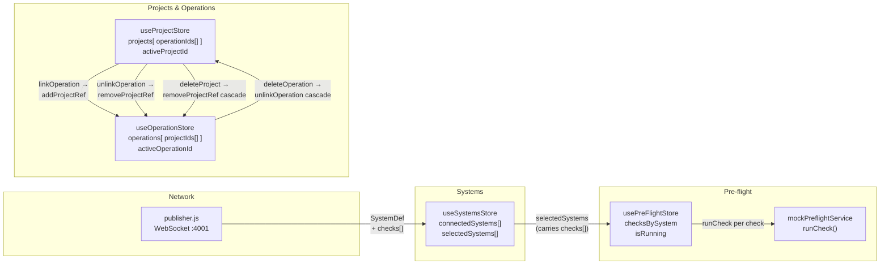

## Data Flow

```mermaid
flowchart LR
  subgraph "Network"
    PUB["publisher.js\nWebSocket :4001"]
  end

  subgraph "Systems"
    SS["useSystemsStore\nconnectedSystems[]\nselectedSystems[]"]
  end

  subgraph "Pre-flight"
    PS["usePreFlightStore\nchecksBySystem\nisRunning"]
    SVC["mockPreflightService\nrunCheck()"]
  end

  subgraph "Projects & Operations"
    PJS["useProjectStore\nprojects[ operationIds[] ]\nactiveProjectId"]
    OS["useOperationStore\noperations[ projectIds[] ]\nactiveOperationId"]
  end

  PUB -->|"SystemDef\n+ checks[]"| SS
  SS -->|"selectedSystems\n(carries checks[])"| PS
  PS -->|"runCheck per check"| SVC

  PJS -->|"linkOperation →\naddProjectRef"| OS
  PJS -->|"unlinkOperation →\nremoveProjectRef"| OS
  PJS -->|"deleteProject →\nremoveProjectRef cascade"| OS
  OS -->|"deleteOperation →\nunlinkOperation cascade"| PJS
```
