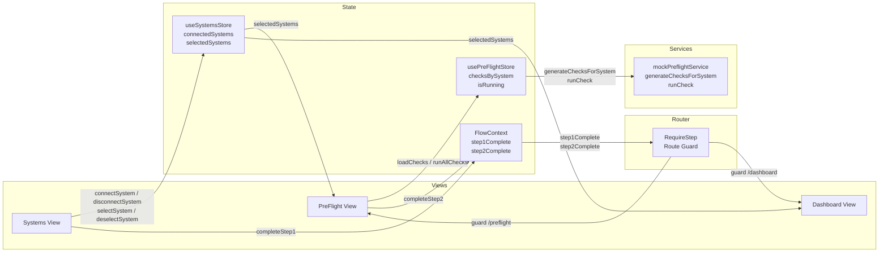

## RotvFlight Data Flow

```mermaid
flowchart LR
  subgraph Views
    SV["Systems View"]
    PV["PreFlight View"]
    DV["Dashboard View"]
  end

  subgraph State
    FC["FlowContext\nstep1Complete\nstep2Complete"]
    SS["useSystemsStore\nconnectedSystems\nselectedSystems"]
    PS["usePreFlightStore\nchecksBySystem\nisRunning"]
  end

  subgraph Services
    MS["mockPreflightService\ngenerateChecksForSystem\nrunCheck"]
  end

  subgraph Router
    RG["RequireStep\nRoute Guard"]
  end

  SV -->|"connectSystem / disconnectSystem\nselectSystem / deselectSystem"| SS
  SV -->|"completeStep1"| FC
  SS -->|"selectedSystems"| PV
  PV -->|"loadChecks / runAllChecks"| PS
  PS -->|"generateChecksForSystem\nrunCheck"| MS
  PV -->|"completeStep2"| FC
  FC -->|"step1Complete\nstep2Complete"| RG
  RG -->|"guard /preflight"| PV
  RG -->|"guard /dashboard"| DV
  SS -->|"selectedSystems"| DV
```
