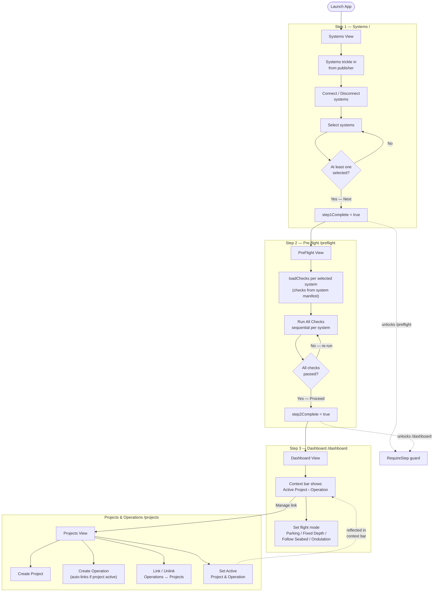

## User Flow

```mermaid
flowchart TD
  START([Launch App]) --> SV

  subgraph S1["Step 1 — Systems  /"]
    SV["Systems View"]
    SV --> DISC["Systems trickle in\nfrom publisher"]
    DISC --> CONN["Connect / Disconnect\nsystems"]
    CONN --> SEL["Select systems"]
    SEL --> GATE1{At least one\nselected?}
    GATE1 -->|"No"| SEL
    GATE1 -->|"Yes — Next"| DONE1["step1Complete = true"]
  end

  DONE1 --> PV

  subgraph S2["Step 2 — Pre-flight  /preflight"]
    PV["PreFlight View"]
    PV --> LOAD["loadChecks per selected system\n(checks from system manifest)"]
    LOAD --> RUN["Run All Checks\nsequential per system"]
    RUN --> GATE2{All checks\npassed?}
    GATE2 -->|"No — re-run"| RUN
    GATE2 -->|"Yes — Proceed"| DONE2["step2Complete = true"]
  end

  DONE2 --> DV

  subgraph S3["Step 3 — Dashboard  /dashboard"]
    DV["Dashboard View"]
    DV --> CTX["Context bar shows\nActive Project › Operation"]
    CTX --> MODES["Set flight mode\nParking / Fixed Depth /\nFollow Seabed / Ondulation"]
  end

  CTX -->|"Manage link"| PROJ

  subgraph PM["Projects & Operations  /projects"]
    PROJ["Projects View"]
    PROJ --> CP["Create Project"]
    PROJ --> CO["Create Operation\n(auto-links if project active)"]
    PROJ --> LNK["Link / Unlink\nOperations ↔ Projects"]
    PROJ --> ACT["Set Active\nProject & Operation"]
  end

  ACT -.->|"reflected in\ncontext bar"| CTX

  GUARD["RequireStep guard"]
  DONE1 -.->|"unlocks /preflight"| GUARD
  DONE2 -.->|"unlocks /dashboard"| GUARD
```
