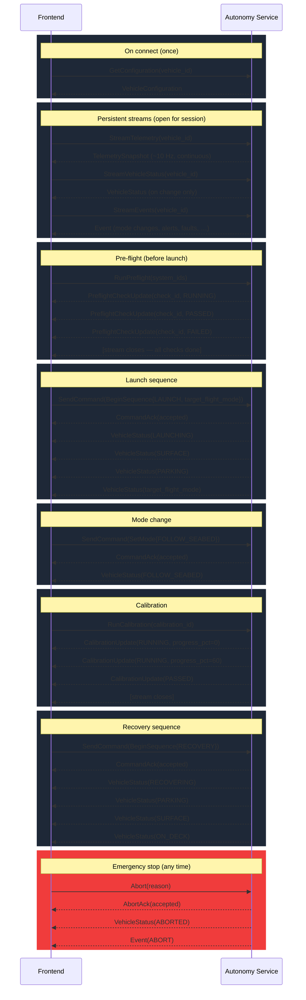

# Autonomy Service — RPC Flow

```mermaid
sequenceDiagram
    participant FE as Frontend
    participant AS as Autonomy Service

    rect rgb(30, 40, 55)
        note over FE,AS: On connect (once)
        FE->>AS: GetConfiguration(vehicle_id)
        AS-->>FE: VehicleConfiguration
    end

    rect rgb(30, 40, 55)
        note over FE,AS: Persistent streams (open for session)
        FE->>AS: StreamTelemetry(vehicle_id)
        AS-->>FE: TelemetrySnapshot (~10 Hz, continuous)

        FE->>AS: StreamVehicleStatus(vehicle_id)
        AS-->>FE: VehicleStatus (on change only)

        FE->>AS: StreamEvents(vehicle_id)
        AS-->>FE: Event (mode changes, alerts, faults, …)
    end

    rect rgb(30, 40, 55)
        note over FE,AS: Pre-flight (before launch)
        FE->>AS: RunPreflight(system_ids)
        AS-->>FE: PreflightCheckUpdate(check_id, RUNNING)
        AS-->>FE: PreflightCheckUpdate(check_id, PASSED)
        AS-->>FE: PreflightCheckUpdate(check_id, FAILED)
        AS-->>FE: [stream closes — all checks done]
    end

    rect rgb(30, 40, 55)
        note over FE,AS: Launch sequence
        FE->>AS: SendCommand(BeginSequence{LAUNCH, target_flight_mode})
        AS-->>FE: CommandAck(accepted)
        AS-->>FE: VehicleStatus(LAUNCHING)
        AS-->>FE: VehicleStatus(SURFACE)
        AS-->>FE: VehicleStatus(PARKING)
        AS-->>FE: VehicleStatus(target_flight_mode)
    end

    rect rgb(30, 40, 55)
        note over FE,AS: Mode change
        FE->>AS: SendCommand(SetMode{FOLLOW_SEABED})
        AS-->>FE: CommandAck(accepted)
        AS-->>FE: VehicleStatus(FOLLOW_SEABED)
    end

    rect rgb(30, 40, 55)
        note over FE,AS: Calibration
        FE->>AS: RunCalibration(calibration_id)
        AS-->>FE: CalibrationUpdate(RUNNING, progress_pct=0)
        AS-->>FE: CalibrationUpdate(RUNNING, progress_pct=60)
        AS-->>FE: CalibrationUpdate(PASSED)
        AS-->>FE: [stream closes]
    end

    rect rgb(30, 40, 55)
        note over FE,AS: Recovery sequence
        FE->>AS: SendCommand(BeginSequence{RECOVERY})
        AS-->>FE: CommandAck(accepted)
        AS-->>FE: VehicleStatus(RECOVERING)
        AS-->>FE: VehicleStatus(PARKING)
        AS-->>FE: VehicleStatus(SURFACE)
        AS-->>FE: VehicleStatus(ON_DECK)
    end

    rect rgb(240, 60, 60)
        note over FE,AS: Emergency stop (any time)
        FE->>AS: Abort(reason)
        AS-->>FE: AbortAck(accepted)
        AS-->>FE: VehicleStatus(ABORTED)
        AS-->>FE: Event(ABORT)
    end
```
