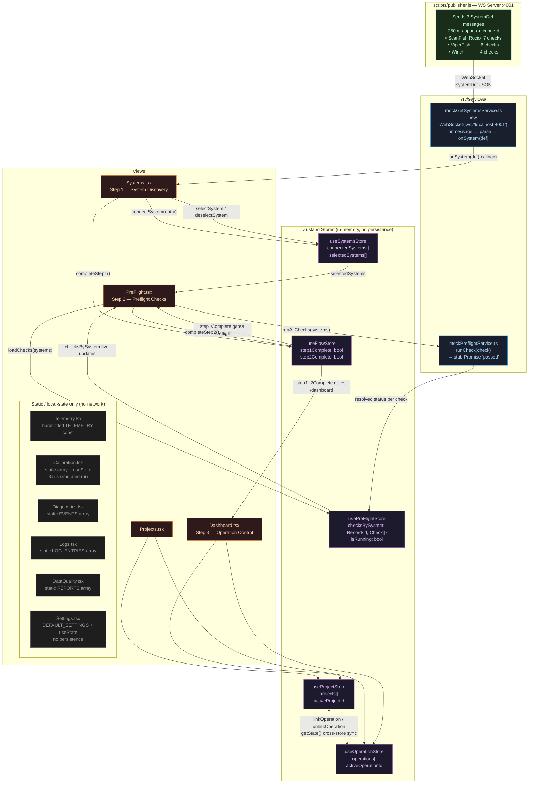

# Data Flow Diagram

```mermaid
flowchart TD
    subgraph SERVER["scripts/publisher.js — WS Server :4001"]
        PUB["Sends 3 SystemDef messages\n250 ms apart on connect\n• ScanFish Rocio  7 checks\n• ViperFish        6 checks\n• Winch            4 checks"]
    end

    subgraph SERVICE["src/services/"]
        MGS["mockGetSystemsService.ts\nnew WebSocket('ws://localhost:4001')\nonmessage → parse → onSystem(def)"]
        MPS["mockPreflightService.ts\nrunCheck(check)\n→ stub Promise 'passed'"]
    end

    subgraph STORES["Zustand Stores  (in-memory, no persistence)"]
        FST["useFlowStore\nstep1Complete: bool\nstep2Complete: bool"]
        SST["useSystemsStore\nconnectedSystems[]\nselectedSystems[]"]
        PST["usePreFlightStore\nchecksBySystem: Record‹id, Check[]›\nisRunning: bool"]
        PROJ["useProjectStore\nprojects[]\nactiveProjectId"]
        OPS["useOperationStore\noperations[]\nactiveOperationId"]
    end

    subgraph VIEWS["Views"]
        SYS["Systems.tsx\nStep 1 — System Discovery"]
        PF["PreFlight.tsx\nStep 2 — Preflight Checks"]
        DB["Dashboard.tsx\nStep 3 — Operation Control"]
        PROJV["Projects.tsx"]

        subgraph STATIC["Static / local-state only  (no network)"]
            TEL["Telemetry.tsx\nhardcoded TELEMETRY const"]
            CAL["Calibration.tsx\nstatic array + useState\n3.5 s simulated run"]
            DIAG["Diagnostics.tsx\nstatic EVENTS array"]
            LOGS["Logs.tsx\nstatic LOG_ENTRIES array"]
            DQ["DataQuality.tsx\nstatic REPORTS array"]
            SET["Settings.tsx\nDEFAULT_SETTINGS + useState\nno persistence"]
        end
    end

    %% Network flow
    PUB -->|"WebSocket\nSystemDef JSON"| MGS

    %% Service → View → Store
    MGS -->|"onSystem(def) callback"| SYS
    SYS -->|"connectSystem(entry)"| SST
    SYS -->|"selectSystem / deselectSystem"| SST
    SYS -->|"completeStep1()"| FST

    %% Guard
    FST -->|"step1Complete gates /preflight"| PF
    FST -->|"step1+2Complete gates /dashboard"| DB

    %% PreFlight flow
    SST -->|"selectedSystems"| PF
    PF -->|"loadChecks(systems)"| PST
    PF -->|"runAllChecks(systems)"| MPS
    MPS -->|"resolved status per check"| PST
    PST -->|"checksBySystem live updates"| PF
    PF -->|"completeStep2()"| FST

    %% Dashboard / Projects
    PROJ <-->|"linkOperation / unlinkOperation\ngetState() cross-store sync"| OPS
    PROJV --> PROJ
    PROJV --> OPS
    DB --> PROJ
    DB --> OPS

    %% Styling
    classDef server  fill:#1a2c1a,stroke:#2d9c5a,color:#b6f5c8
    classDef service fill:#1a1f2e,stroke:#1e90d4,color:#a8d4f5
    classDef store   fill:#1e1a2e,stroke:#9b59b6,color:#dab6f5
    classDef view    fill:#2e1a1a,stroke:#e87c2e,color:#f5d0a8
    classDef static  fill:#1e1e1e,stroke:#555,color:#999

    class PUB server
    class MGS,MPS service
    class FST,SST,PST,PROJ,OPS store
    class SYS,PF,DB,PROJV view
    class TEL,CAL,DIAG,LOGS,DQ,SET static
```
