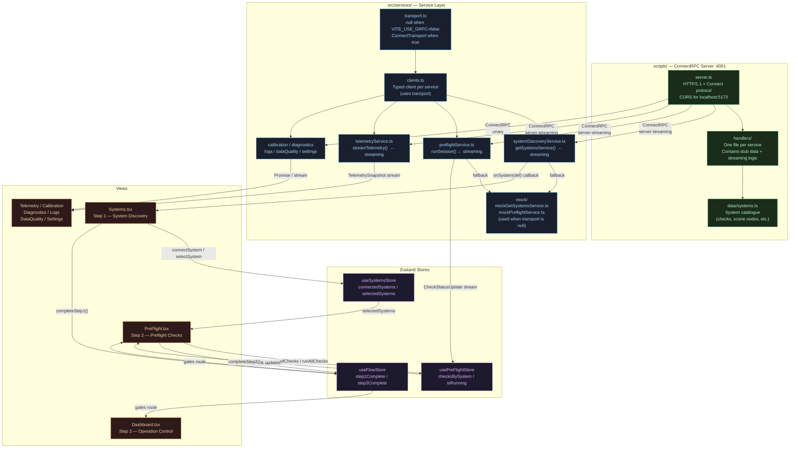

# Data Flow Diagram

## Overview

```
VITE_USE_GRPC=true   →  browser talks to ConnectRPC server (scripts/server.ts :4001)
VITE_USE_GRPC=false  →  service files return static fallback data (no server needed)
```



## Request lifecycle (example: Systems view loads)

```
1. Systems.tsx mounts
2. calls getSystemsService(onSystem)
3. service checks transport:
   - null  → mockGetSystemsService() streams 3 systems from static data
   - set   → opens ConnectRPC stream to server:4001/DiscoverSystems
4. server yields one SystemDef every 250 ms
5. each message → onSystem(def) → SST.connectSystem()
6. Systems.tsx re-renders as systems arrive
7. on unmount → cleanup() → ctrl.abort() → stream closes silently
```

## Adding / changing data

| What | Where |
|------|-------|
| Which systems appear | `scripts/data/systems.ts` |
| Check definitions (labels, scene nodes) | `scripts/data/systems.ts` |
| Check pass / fail outcome | `scripts/handlers/preflight.ts` |
| Telemetry values | `scripts/handlers/telemetry.ts` |
| Calibration records | `scripts/handlers/calibration.ts` |
| Diagnostic events | `scripts/handlers/diagnostics.ts` |
| Log entries | `scripts/handlers/logs.ts` |
| Data quality reports | `scripts/handlers/dataQuality.ts` |
| Default settings | `scripts/handlers/settings.ts` |
