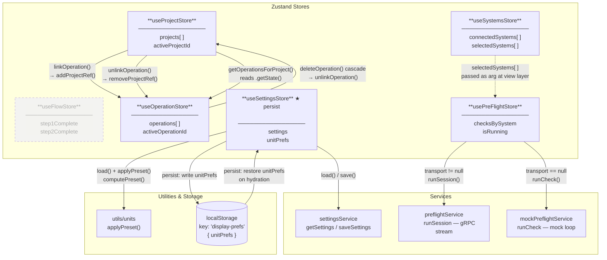

# Store Relationships



## Summary

| Store | Role | Direct Store Dependencies |
|---|---|---|
| `useFlowStore` | Wizard step flags (step 1 / 2) | None — isolated |
| `useSystemsStore` | Live system registry (connected / selected) | None — feeds others via view props |
| `useProjectStore` | Project CRUD + many-to-many link management | `useOperationStore` (reads + writes) |
| `useOperationStore` | Operation CRUD + per-operation project refs | `useProjectStore` (cascade delete only) |
| `usePreFlightStore` | Runs preflight checks via gRPC or mock | None — receives `SystemEntry[]` as arg |
| `useSettingsStore` | App settings + unit prefs, persisted | None — talks to services + utils |

### Key design notes

- **Project ↔ Operation** is a true bidirectional many-to-many managed across both stores.
  `useProjectStore` is the *owner* of link mutations; `useOperationStore` just maintains its side of the ref.

- **useSystemsStore → usePreFlightStore** is *not* a store import — `selectedSystems` is passed as an argument by the PreFlight view. The stores are decoupled.

- **usePreFlightStore** branches at runtime on whether `transport` is non-null (gRPC enabled) and routes to the real service or the mock accordingly.

- **useSettingsStore** is the only store using Zustand `persist`; it only hydrates `unitPrefs` (not the full settings object, which comes from the server).
```
